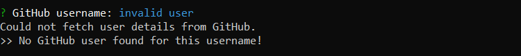
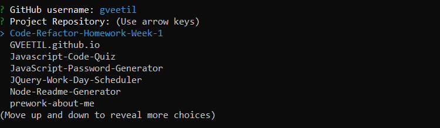
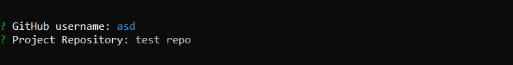

# Readme Generator

## Description
The Readme Generator is a command-line Node.js application that dynamically generates a README.md file for any GitHub user. This application provides users with a quick and easy way to create a quality project README file for their repository that contains:  

* Basic project title and description
* Link to the project homepage
* Installation Instructions
* Usage Guidelines
* Testing Guidelines
* Questions
* Auto generated badges
* License Disclaimer
* User details - email and picture

## Application Demo


## Table of Contents 

- [Installation Instructions](#installation-instructions)
- [Usage Guidelines](#usage-guidelines)
- [Open Issues](#open-issues)

## Installation Instructions

- #### Node.js  
This application needs Node.js to execute. To install Node.js, run the appropriate installer from https://nodejs.org/en/download/ and follow the prompts to complete the installation. 

- #### Clone this repo
 Clone this repo to your local machine using:
```shell
git clone `https://github.com/Gveetil/Node-Readme-Generator.git`
```

- #### Install packages
You will also need to install the below npm packages to your environment:
 - axios
 - dotenv
 - inquirer

 Browse to the folder where you cloned the Repo and install the packages:
```shell
$ npm install 
```

- #### Env settings
 This application uses a GitHub access token to access user information from GitHub. This needs to be configured in the .env file.
You could choose to skip this step and the Readme Generation will still work without the user's email address.

 > 
 To configure the GitHub access token in the .env file:
 > Create a new GitHub access token - see:
 >
 > https://help.github.com/en/github/authenticating-to-github/creating-a-personal-access-token-for-the-command-line
 > 
 >(Ensure the **user - user:email** check box is checked when creating your token.)
 >
 > Browse to the folder where you cloned the Repo and create a file named .env
 > 
 > Open this file, add the below key and save:
```
GITHUB_TOKEN=<your-github-access-token>
```

- #### Execute the program
To run the program, browse to the local folder where you cloned the Repo and execute 
```shell
$ npm start 
```
The app should now start executing.

## Usage Guidelines
- When the application is executed, first the user is prompted to enter their GitHub username.
- The application then checks if it is a valid github username. If the name is not valid, the application exits with the following message:



- If the name is valid, the application then fetches a list of the user's GitHub repositories.



- If no repositories are found for the user, the application also provides an option to enter a new repository name: 



(Note: Readme badges generated for this repo will not work until this repository is created in git hub.)
- Once the user selects the repository the application fetches the project title and description from GitHub. The user has the option to edit these.
- Next the user is prompted to enter installation instructions, usage guidelines, testing guidelines and questions. These can be entered as text or copy pasted. To seperate multiple lines, use the `<br>` tag.
- The user then has an option of selecting the badges to display in the Readme file:


- Lastly, the user can select the Project License type to be used in the Readme file:


- The application then generates the readme file in a local folder named `output`. All readme files are generated with a timestamp to ensure they do not overwrite existing files.

## Open Issues
The application currently uses the GitHub `access_token` as part of a query parameter to access GitHub APIs. This needs to be updated to use the Authorization HTTP header instead, as using the `access_token` query parameter is deprecated and may cease to work at a later point. 
